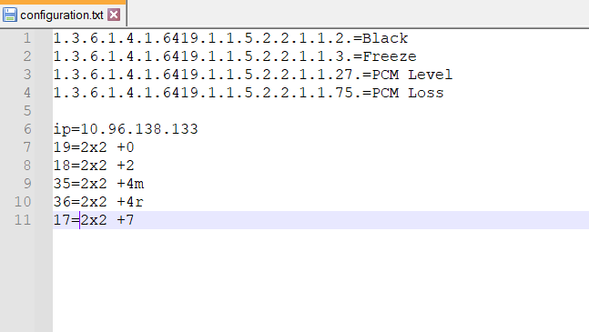

# SNMP Alarm Monitoring

Main goal of this project is to minimize reaction time to problems with broadcast equipment 
(especially MultiViewers (MV)), that are able to send SNMP traps on failure (such as video freeze, video black, 
loss of audio, low audio level).

Visual interface looks like this: 

It consists of list of buttons on the left and log area on the right. Number of buttons and their names are set in the 
/config/configuration.txt file.

The structure of configuration file:
1. List of SNMP OID's, that must be monitored, and name of the alarm divided by '='
2. Empty line
3. Ip address of the SNMP trap source.
4. List of SNMP OID's last digits and corresponding name. In case of MV those digits are input values. If several 
sources must be monitored. Than next device configuration should be added directly added after. Like this:

Number of buttons and their names in the UI is set depending on configuration (part after ip address). When alarm is 
triggered corresponding button lights up, alarm sound is being played and log message is displayed. Alarm sound can be 
set by putting alarm.wav file in /alarm folder of the project. 

After analyzing the alarm user can acknowledge it by pressing button with the alarm state. Button color is set to 
default and acknowledge message is displayed in log section. 

